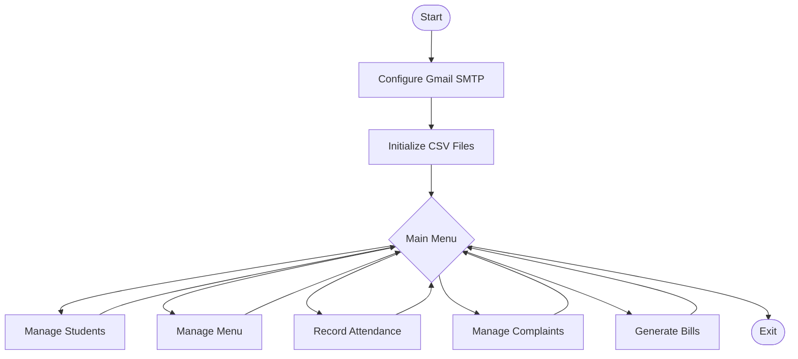
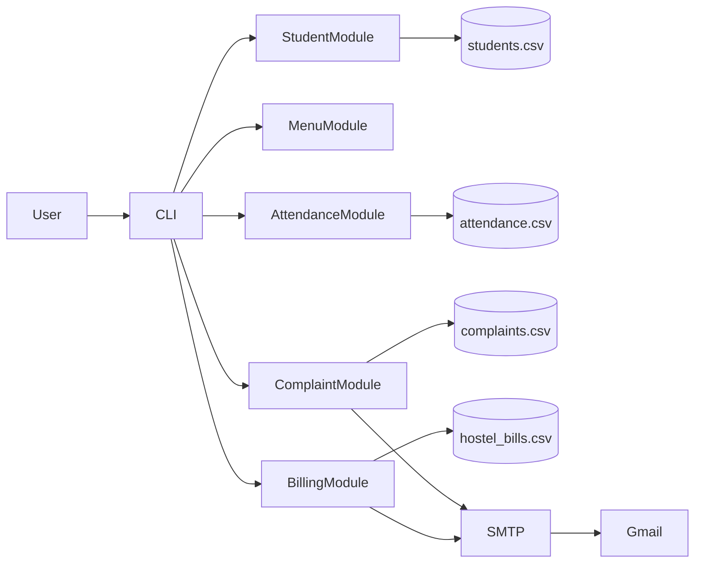
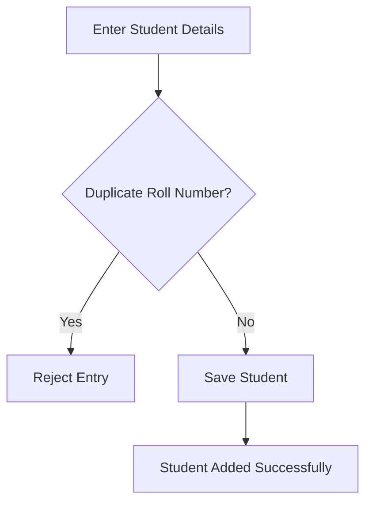
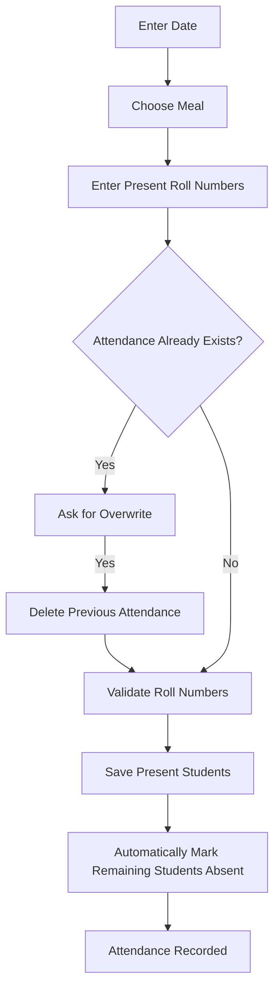
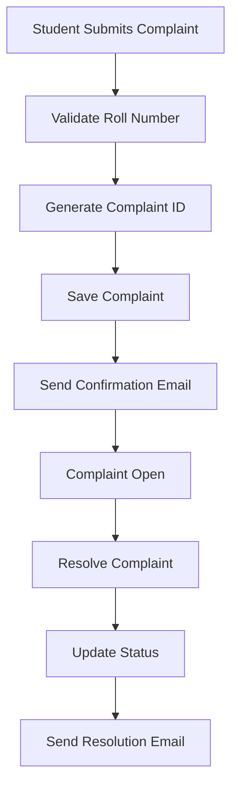
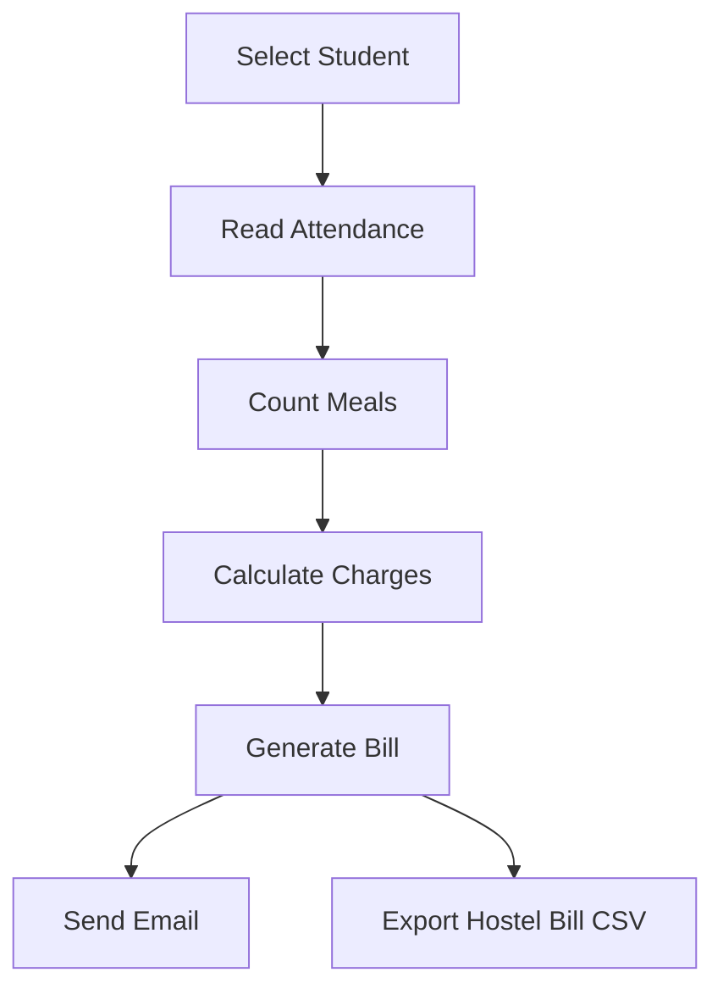

# 🏠 Smart Campus Hostel Mess Management System

<div align="center">


### A Python-based command-line application for efficient hostel mess management with CSV storage and Gmail SMTP notifications.

</div>

---

## 📖 Overview

The **Smart Campus Hostel Mess Management System** is a lightweight command-line application developed in **Python** to automate day-to-day hostel mess operations. It helps administrators manage student records, maintain the weekly menu, record meal attendance, handle complaints, and generate monthly bills through a simple menu-driven interface.

The application stores all information in CSV files, making it easy to use without requiring any external database. Optional Gmail SMTP integration allows automatic email notifications for complaints and billing.

---

## ✨ Features

- 👨‍🎓 Student Registration and Management
- 🍽 Weekly Mess Menu Management
- ✅ Meal Attendance Recording
- 🚫 Automatic Absent Marking
- 🔄 Duplicate Attendance Detection
- 📢 Complaint Registration and Resolution
- 📧 Automated Gmail Email Notifications
- 💰 Monthly Bill Generation
- 📄 Hostel-wise Bill Export
- 🛡 Robust Error and Exception Handling

---

## 🚀 Application Workflow



---

## 🏗 System Architecture



---

## 👨‍🎓 Student Management



---

## 🍽 Attendance Management



---

## 📢 Complaint Management



---

## 💰 Bill Generation



---

## 📂 Project Structure

```text
Smart-Campus-Hostel-Mess-Management/
│
├── 2401CS09_CS3103_Lab1.py
├── students.csv
├── attendance.csv
├── complaints.csv
├── hostel_bills_YYYY-MM.csv
├── README.md
└── Rahul_Kumar_Sahoo_2401CS09_lab_1_28_07_2026.pdf
```

---

## 🛠 Technologies Used

- Python 3
- CSV Module
- Dataclasses
- Pathlib
- Datetime
- Gmail SMTP
- MIMEText
- Getpass
- Object-Oriented Programming
- Exception Handling

---

## ⚙ Installation

Clone the repository

```bash
git clone https://github.com/<your-username>/Smart-Campus-Hostel-Mess-Management.git
```

Navigate to the project directory

```bash
cd Smart-Campus-Hostel-Mess-Management
```

Run the application

```bash
python 2401CS09_CS3103_Lab1.py
```

---

## 📧 Gmail SMTP Configuration

At startup, the application optionally asks for:

- Gmail Address
- Gmail App Password

If you do not wish to enable email notifications, simply press **Enter** twice to continue.

---

## 📊 Billing Formula

```text
Total Bill = Base Charge + (Meals Consumed × Per Meal Rate)
```

Example

```text
Base Charge      : ₹2500
Meals Consumed   : 12
Per Meal Charge  : ₹65

Total Bill = ₹2500 + (12 × ₹65)
           = ₹3280
```

---

## 🔒 Error Handling

The application safely handles:

- Duplicate Roll Numbers
- Duplicate Attendance Records
- Invalid Dates
- Invalid Meal Types
- Unknown Student IDs
- Missing Attendance Records
- CSV Read/Write Errors
- SMTP Failures
- Keyboard Interrupts

---

## 🚀 Future Improvements

- SQLite/MySQL Database Support
- User Authentication
- Web-Based Dashboard
- QR Code Attendance
- Mobile Application
- Online Payment Gateway
- Analytics Dashboard
- Hostel Inventory Management
- Multi-Hostel Support

---

## 👨‍💻 Author

**Rahul Kumar Sahoo**

B.Tech in Computer Science and Engineering

Indian Institute of Technology Patna

---

<div align="center">

## 🌸 ଜୟ ଜଗନ୍ନାଥ 🌸

**May Lord Jagannath bless everyone with wisdom, happiness, and success.**

If you found this project useful, consider giving it a ⭐ on GitHub.

**Made with ❤️ and Python 🐍**

</div>
